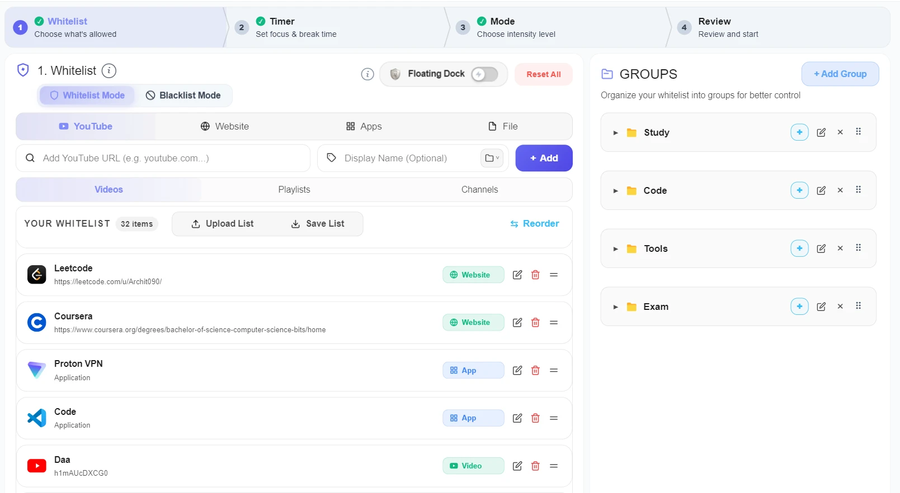
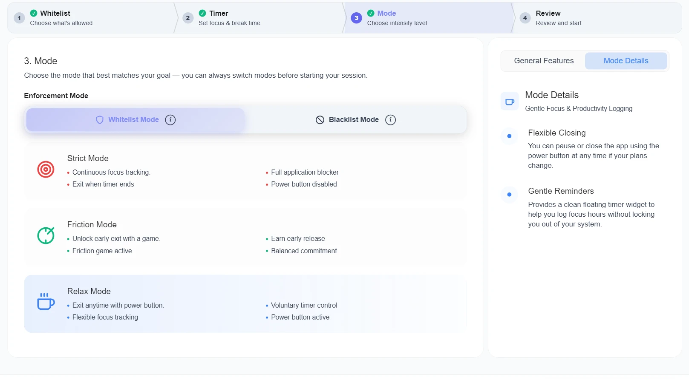
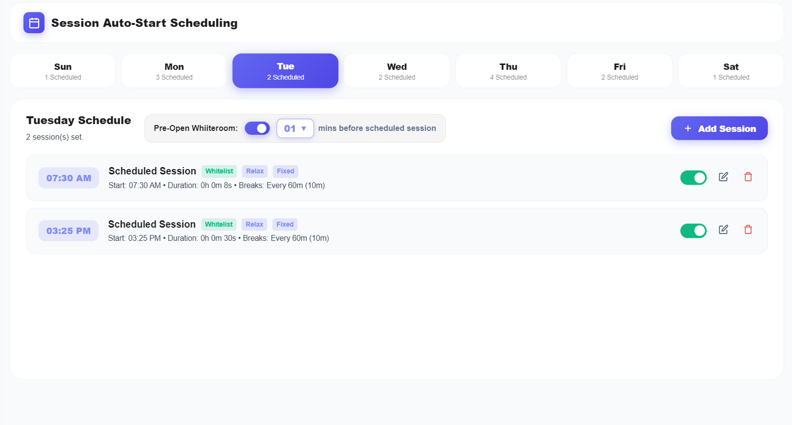
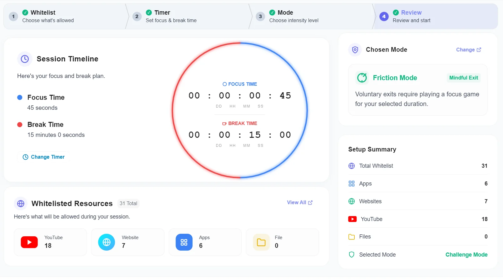
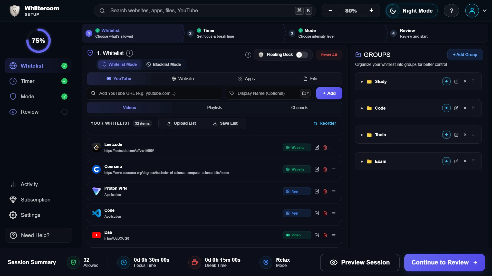
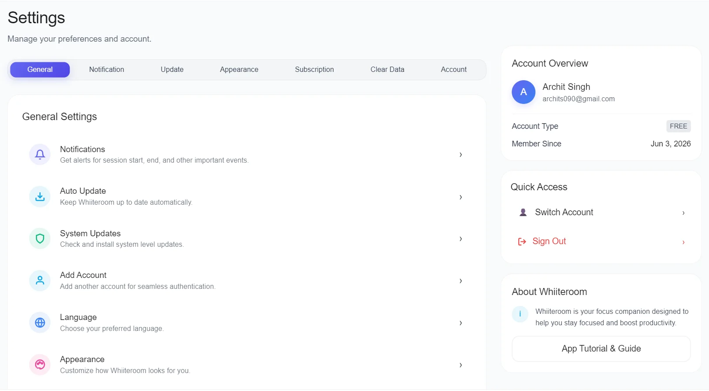

# Whiiteroom

### The OS-Enforced Distraction-Free Focus Workspace for Windows & Android

 

  <strong>Whiiteroom</strong> is a verified, commitment-safe focus environment designed for deep work, study marathons, and competitive exam preparation. Unlike browser extensions, DNS switchers, or soft reminder apps that are trivial to bypass, Whiiteroom enforces session limits directly at the operating system level and inside an embedded Chromium browser — isolating your work and removing digital distractions before they reach your screen.

  <a href="https://whiiteroom.com/#downloads"><strong>📥 Download for Windows & Google Play Store on whiiteroom.com</strong></a> • 
  <a href="https://whiiteroom.com"><strong>⚡ Try Interactive Mockup</strong></a> • 
  <a href="https://whiiteroom.com/docs"><strong>📖 Full Documentation</strong></a>

---

## 💻 Windows Desktop Application Showcase

Full OS-level focus environment with customizable whitelist/blacklist setup, integrated Pomodoro timers, and automated weekly calendar scheduler.

| **Whitelist Setup Interface (Day Mode)** | **Focus Mode Selection (Relax, Friction, Strict)** |
| :---: | :---: |
|  |  |

| **Auto-Start Session Scheduler** | **Pre-Session Review & Launch** |
| :---: | :---: |
|  |  |

| **Full Desktop Workspace Overview (Night)** | **Settings & Preference Controls** |
| :---: | :---: |
|  |  |

---

## 📱 Android Mobile Application Showcase

Mobile app distraction blocking with native app interception, custom focus timers, and embedded browser capabilities.

| **Focus Dashboard & Presets** | **App Whitelist Control** | **Website Whitelist Rules** | **Embedded Distraction-Free Browser** |
| :---: | :---: | :---: | :---: |
|  |  |  |  |

| **Daily Planner & To-Do** | **Interactive Timetable** | **Notes & Sticky Reminders** | **Study Flashcards** |
| :---: | :---: | :---: | :---: |
|  |  |  |  |

---

## 📑 Table of Contents

- [Windows Desktop Application Showcase](#-windows-desktop-application-showcase)
- [Android Mobile Application Showcase](#-android-mobile-application-showcase)
- [The Core Philosophy: "The White Room"](#-the-core-philosophy-the-white-room)
- [How Enforcement Works (Technical Architecture)](#-how-enforcement-works-technical-architecture)
- [Complete Feature Matrix](#-complete-feature-matrix)
  - [1. Whitelist Mode (Allow-Only Control)](#1-whitelist-mode-maximum-control)
  - [2. Blacklist Mode (Block-Only Control)](#2-blacklist-mode-maximum-flexibility)
  - [3. Granular Distraction-Free YouTube Engine](#3-granular-distraction-free-youtube-engine)
  - [4. Auto-Start Session Scheduler](#4-auto-start-session-scheduler)
  - [5. 3 Strictness Levels (Relax, Friction & Strict)](#5-three-focus-strictness-modes)
  - [6. Scheduled Rest Windows & Break Intervals](#6-scheduled-rest-windows--break-intervals)
  - [7. Private Distraction Analytics](#7-private-distraction-analytics)
- [Whiiteroom vs Cold Turkey vs Freedom vs Opal](#-whiiteroom-vs-traditional-focus-apps)
- [Who is Whiiteroom Built For?](#-who-is-whiiteroom-built-for)
- [Supported Platforms & Hardware Requirements](#-supported-platforms--hardware-requirements)
- [Safety, Clean Operation & Privacy Guarantees](#-safety-clean-operation--privacy-guarantees)
- [Download & Installation](#-download--installation)
- [Frequently Asked Questions (FAQ)](#-frequently-asked-questions-faq)
- [Community, Issues & Feature Requests](#-community-issues--feature-requests)

---

## 🏛️ The Core Philosophy: "The White Room"

Imagine you are in a physical room:
* On one side sits a textbook or coding challenge you need to conquer.
* On the other side sits a gaming console, a phone with infinite video reels, and buzzing social media apps.

When both options sit in the same room, equally effortless to reach, human willpower inevitably breaks. The problem with modern devices is that **the study room and the entertainment center are the exact same machine**. Your laptop for exam prep or deep programming is the same laptop that houses Discord, Steam, Twitter, and endless browser tabs.

**Whiiteroom changes the environment digitally.**
Before a session starts, you define your focus boundaries. Once you click start or your scheduled timer triggers, everything not explicitly approved is removed from the room. You don't need superhuman willpower because the temptation is physically stripped from your operating system until the work is done.

---

## ⚙️ How Enforcement Works (Technical Architecture)

Unlike standard blockers that rely on easily disabled Chrome extensions or circumventable local proxy servers, Whiiteroom implements a multi-tiered native security and focus enforcement engine:

1. **OS-Level Process Interception:**
   Whiiteroom enumerates running processes directly via Windows native APIs (`CreateToolhelp32Snapshot`, `Process32Next`, `TerminateProcess`). Any unapproved `.exe` application (games, messaging apps, secondary browsers) launched during an active session is terminated instantly upon detection.
2. **Embedded Chromium Web Workspace:**
   Standard external browsers (Chrome, Edge, Firefox, Brave) are suppressed during sessions. All approved web research runs inside Whiiteroom's embedded Chromium browser. Unwhitelisted web origins and third-party trackers are aborted before HTTP requests are dispatched over the network.
3. **DOM-Level YouTube Content Stripper:**
   When YouTube resources (video lectures, course playlists, or educational channels) are approved, Whiiteroom's internal parser removes homepage feeds, sidebar recommendations, Shorts reels, user comments, and autoplay triggers directly from the DOM tree. Only the chosen educational media plays.
4. **Crash & Reboot Persistence:**
   Active session timers, lockdown flags, and allowed profiles are serialized into a local SQLite database with startup registry hooks. If a device experiences a sudden power loss or restart, Whiiteroom boots automatically on startup and immediately restores the lockdown for the exact remaining duration.

---

## 🌟 Complete Feature Matrix

### 1. Whitelist Mode (Maximum Control)
* **Allow-Only Philosophy:** Everything outside your explicit list is blocked by default.
* **Granular Item Support:** Whitelist entire desktop applications, specific websites, exact URLs, or local files (PDF textbooks, markdown notes, code repositories).
* **Search & AI Assistance:** Whitelist `google.com` or AI assistants (`chatgpt.com`, `claude.ai`, `gemini.google.com`) so you can search documentation and ask technical questions without needing open web access.

### 2. Blacklist Mode (Maximum Flexibility)
* **Block-Only Control:** Born from months of beta feedback from researchers, writers, and exploratory programmers.
* **Targeted Suppression:** Block only your known time-sink apps, social media domains, and video portals while keeping the rest of the web and developer tools completely open for spontaneous research.
* **Zero Extra Cost:** Both Whitelist Mode and Blacklist Mode are included in all standard setups.

### 3. Granular Distraction-Free YouTube Engine
* **Video Whitelisting:** Add single educational video URLs.
* **Playlist & Channel Whitelisting:** Add full course playlists or instructor channels.
* **Algorithmic Isolation:** Access the knowledge you need on YouTube without the algorithmic traps designed to hijack your attention.

### 4. Auto-Start Session Scheduler
* **Weekly Focus Calendar:** Plan focus routines across Monday through Sunday with custom start times.
* **Recurring vs One-Time:** Configure **Permanent** recurring weekly schedules or **One-Time** revision sessions that auto-delete after completion.
* **Independent Lists Per Schedule:** Assign different custom whitelists/blacklists to different schedules (e.g., Physics morning session vs Coding afternoon session).
* **Pre-Launch Notifications:** Get a heads-up warning 1 to 15 minutes before the session automatically locks your workspace.

### 5. Three Focus Strictness Modes
* **🟢 Relax Mode:** Focus with flexibility. Allows instant early exit at any point without barriers. Ideal for initial habit building.
* **🟡 Friction Mode:** Solves impulsive session quitting by requiring deliberate unlock tasks (typing challenges / puzzles) before exiting early.
* **🔴 Strict Mode:** Full commitment. No early exit button exists. The workspace remains locked until the session timer expires, with emergency recovery mechanisms intentionally difficult to access.

### 6. Scheduled Rest Windows & Break Intervals
* **Sustainable Deep Work:** Set customizable work/rest cycles (e.g., 50 min work / 10 min break, or 25 min / 5 min Pomodoro).
* **Automated Rest Windows:** During scheduled breaks, workspace restrictions lift completely for full device access.
* **Seamless Auto-Resume:** When the break countdown reaches zero, Whiiteroom automatically re-locks the workspace and resumes your study time without manual intervention.

### 7. Private Distraction Analytics
* **Distraction Score mirror:** Real-time logging of blocked app launch attempts and unauthorized domain requests.
* **Zero Cloud Telemetry:** All study streak data, focus durations, and profile configs reside strictly in local device storage.

---

## ⚖️ Whiiteroom vs Traditional Focus Apps

| Feature / Capability | Whiiteroom | Cold Turkey | Freedom | Opal |
| :--- | :---: | :---: | :---: | :---: |
| **Whitelist Mode (Allow-Only Engine)** | **Native OS-Level** Everything blocked by default | **Partial** Desktop only | **No** Blacklist only | **No** Blacklist only |
| **Blacklist Mode (Block-Only Control)** | **Yes** Switchable per profile | **Yes** | **Yes** | **Yes** |
| **Granular YouTube Filtering** | **Yes** Whitelist video/playlist/channel; strips feeds & Shorts | **No** Domain block only | **No** Domain block only | **No** Domain block only |
| **Auto-Start Session Scheduler** | **Yes** Weekly recurring & one-time calendar with pre-launch warning | **No** Manual start required | **No** Manual start required | **No** Manual start required |
| **Scheduled Break Windows** | **Yes** Auto-lift & auto-resume timer windows | **No** Binary block duration | **No** Binary block duration | **No** Binary block duration |
| **Kernel / OS-Level Enforcement** | **Yes** Process enum & Chromium browser control | **Yes** Registry locking | **No** VPN / DNS proxy level | **No** Screen Time API (iOS) |
| **Crash & Reboot Persistence** | **Yes** Auto re-locks upon reboot via local SQLite state | **Partial** Re-engages on boot | **No** Session ends on restart | **Partial** iOS Screen Time dependent |
| **Data Privacy & Telemetry** | **100% Local Device** Zero tracking, zero cloud logging | **Local** | **Cloud-Synced** | **Cloud-Synced** |
| **Cross-Platform Availability** | **Windows 10/11 & Android** (macOS & iOS on roadmap) | **Windows & macOS** (No mobile app) | **Windows, Mac, iOS, Android** | **iOS & macOS Only** (No Windows / Android) |
| **Launch Pricing Model** | **100% Free PRO Access** (Launch phase offer) | **$29.99 USD** (One-time Pro license) | **$39.99 / year** (Subscription) | **$59.99 / year** (Subscription) |

---

## 🎯 Who is Whiiteroom Built For?

* **Competitive Exam Aspirants (JEE, NEET, UPSC, GATE, CA, CFA):** Fixed study timetables, massive syllabus coverage, and high stakes where losing hours to social media or short reels has real consequences.
* **Software Engineers & Technical Writers:** Long 90+ minute uninterrupted coding sprints requiring terminal, IDE, and documentation isolation without Slack/Reddit interruptions.
* **Researchers & Thesis Students:** Structured literature reading with local PDF files, whitelisted journal databases, and distraction-free reference lookups.
* **Anyone Struggling with Impulsive Context Switching:** Individuals who find soft reminders and basic browser blockers too easy to dismiss or override when willpower runs out.

---

## 💻 Supported Platforms & Hardware Requirements

| Platform | Supported Versions | Architecture | Distribution & Security |
| :--- | :--- | :--- | :--- |
| **Windows Desktop** | Windows 10 & Windows 11 | 64-bit (x64) | Official Signed Installer via [whiiteroom.com](https://whiiteroom.com/#downloads) |
| **Android Mobile** | Android 9.0 and higher | ARM64 / ARMv7 | Official Google Play Store via [whiiteroom.com](https://whiiteroom.com/#downloads) |
| **macOS & iOS** | In Active Development | Apple Silicon / Intel / iOS | Official App Store Releases *(Coming Soon)* |

---

## 🔒 Safety, Clean Operation & Privacy Guarantees

Whiiteroom is engineered with strict ethical software design principles to ensure total device security, zero telemetry invasion, and completely transparent local operation:

* 🛡️ **100% Local-First Architecture:** All your whitelist profiles, focus timer metrics, and study streak statistics are stored exclusively in a local SQLite database on your machine. No browsing history or personal data is ever collected, transmitted, or sold.
* 🧹 **Clean System Integration & Reversibility:** Whiiteroom does not modify your core system files, DNS servers, or network drivers. Once a session completes (or when you are outside an active session), 100% of standard OS controls, apps, and browsers remain fully accessible.
* 📦 **Standard Safe Installer & Full Uninstall Support:** Whiiteroom installs cleanly into standard user directories with a standard uninstaller. It does not install root certificates, background kernel drivers, or hidden persistent daemons.
* 🧪 **Independent Security Verification (0/70 Clean on VirusTotal):** You can inspect and verify any official Whiiteroom release binary using industry-standard multi-engine antivirus analyzers:
  * 🔍 **Live VirusTotal Report (0/70 Clean):** https://www.virustotal.com/gui/file/9a7098fbb335cbfc589f353ebd4503d28e28397ce087ee659baa2a4bff6502e0
  * 📋 **SHA-256 Checksum:** `9a7098fbb335cbfc589f353ebd4503d28e28397ce087ee659baa2a4bff6502e0`
  * 🛡️ [Hybrid Analysis Malware Sandbox](https://www.hybrid-analysis.com/)
* 🌐 **Verified Distribution:** All official binaries and mobile store releases are published directly through [whiiteroom.com](https://whiiteroom.com) and the Google Play Store.

---

## 📥 Download & Installation

All official, verified releases for Windows and Android (Google Play Store) are available through the official website:

### 👉 [https://whiiteroom.com/#downloads](https://whiiteroom.com/#downloads)

1. **Windows 10 / 11 Desktop:**
   * Visit [whiiteroom.com/#downloads](https://whiiteroom.com/#downloads) and click **Download for Windows**.
   * Run the installer wizard (`Whiiteroom-Windows-Setup.exe`).
   * **Note on Windows SmartScreen (Blue Screen Prompt):** As an independent developer project currently undergoing initial distribution, commercial EV (Extended Validation) code-signing certificates are in the process of being acquired. If Windows SmartScreen displays a *"Windows protected your PC"* prompt on first launch:
     1. Click **More info**
     2. Click **Run anyway**
     3. *You can independently verify the installer anytime on [VirusTotal](https://www.virustotal.com/gui/file/9a7098fbb335cbfc589f353ebd4503d28e28397ce087ee659baa2a4bff6502e0) using its SHA-256 hash (`9a7098fbb335cbfc589f353ebd4503d28e28397ce087ee659baa2a4bff6502e0`) to confirm a 100% clean 0/70 score.*
   * Launch Whiiteroom, select your preferred mode (Whitelist or Blacklist), and start your session.
2. **Android Mobile:**
   * Visit [whiiteroom.com/#downloads](https://whiiteroom.com/#downloads) to get the direct Google Play Store install link for your Android device.
   * Follow the standard in-app onboarding to configure your focus preferences.

---

## ❓ Frequently Asked Questions (FAQ)

#### What happens if my computer restarts or loses power during a Strict Mode session?
Whiiteroom persists your session countdown timer to a local SQLite database on your device. Upon reboot, the application re-engages the focus boundaries seamlessly for the remaining duration so that accidental restarts do not disrupt your deep work cycle.

#### Does Whiiteroom monitor or record my web activity?
No. Whiiteroom operates strictly as a permission guard: it checks if a URL or application is on your approved list and permits or denies access locally. It does not log keystrokes, capture screen recordings, or send telemetry to external servers.

#### Can I use Whiiteroom for open-ended research without knowing every site in advance?
Yes. You can switch to **Blacklist Mode** to suppress only your known time-wasting apps and domains while keeping the rest of the web open, or remain in **Whitelist Mode** and allow Google Search or AI assistants (`chatgpt.com`, `claude.ai`) to summarize external sources for you.

---

## 💬 Community, Issues & Connect

* 🐛 **Found a bug?** [Submit a Bug Report](https://github.com/archits790-ui/whiiteroom-App/issues/new?template=bug_report.yml)
* 💡 **Have a feature idea or feedback?** [Submit a Feature Request](https://github.com/archits790-ui/whiiteroom-App/issues/new?template=feature_request.yml)
* 📖 **Read Full Canonical Guide:** [https://whiiteroom.com/what-is-whiiteroom](https://whiiteroom.com/what-is-whiiteroom)
* 💼 **Official LinkedIn Page:** [Whiiteroom on LinkedIn](https://www.linkedin.com/company/whiiteroom/posts/?feedView=all)
* 👤 **Founder / Creator:** [Archit Singh on LinkedIn](https://www.linkedin.com/in/archit-singh-96a0b4293/)

---

  Built with high commitment for people whose work demands real isolation.
   
   
  <strong>© 2026 Whiiteroom • <a href="https://whiiteroom.com">https://whiiteroom.com</a></strong>
   
  Connect with us on <a href="https://www.linkedin.com/company/whiiteroom/posts/?feedView=all">LinkedIn</a> • Founded by <a href="https://www.linkedin.com/in/archit-singh-96a0b4293/">Archit Singh</a>

